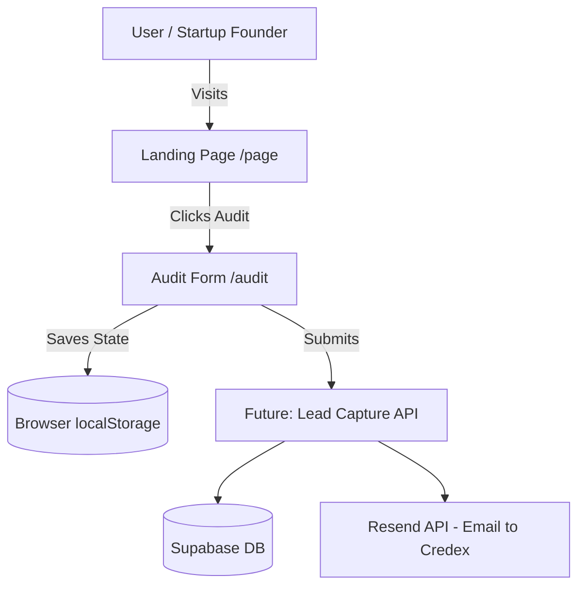

# SpendLens Architecture

## System Diagram

## Why Next.js?
Next.js 14 App Router provides the best balance of fast rendering (server components for static landing pages) and highly interactive client components (for complex forms). The routing system simplifies creating multi-page flows, and it allows seamless integration with Supabase for the backend lead-capture API down the line. It's an industry standard that allows easy onboarding for future developers.

## Data Flow
Currently, data strictly flows from the user inputs into React Hook Form state, which is aggressively synchronized with the browser's `localStorage` via the custom `useFormPersist` hook. This ensures no data is lost on reload. Upon submission, the data is currently logged to the console, ready to be sent to a backend API (Supabase) that will evaluate the inputs and trigger an automated email via Resend to the founder with savings suggestions.

## Scaling to 10k audits/day
At 10,000 audits per day, the current client-heavy form architecture scales perfectly since it uses no backend resources until submission. However, modifications for scale would include:
1. Moving pricing calculation logic securely to the backend so the frontend isn't bloated with pricing logic.
2. Implement edge caching via Vercel/Cloudflare for the landing page.
3. Decouple lead ingestion using a message queue (like Upstash Kafka) to prevent Supabase connection exhaustion during spikes.
4. Implement strict rate limiting using Upstash Redis to prevent abuse of the form submission endpoint.

## Abuse Protection

To ensure the integrity of the audit endpoint and prevent bot spam, we implemented two layers of protection:
1. **Honeypot Field**: A visually hidden input field (`website`) is included in the audit form. Bots typically fill all inputs; if this field contains data during submission, the API silently rejects the request (returning a fake success) without writing to the database.
2. **IP Rate Limiting**: The POST `/api/audit` endpoint implements a simple in-memory map to track submissions per IP address (`x-forwarded-for` header). Requests are limited to 10 per hour per IP. This is chosen as a lightweight, dependency-free solution suitable for V1, avoiding the overhead of Redis until significant traffic requires it.
