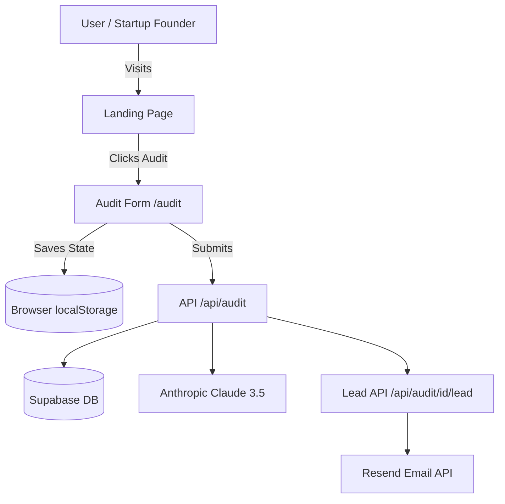

# SpendLens Architecture

## System Diagram

## Tech Stack Justification
- **Next.js 16 (App Router):** Chosen for its superior handling of server-side metadata (for OG tags) and efficient client-side hydration for the complex audit form.
- **Tailwind CSS + shadcn/ui:** Allowed for a premium "editorial" design with rapid prototyping of accessible components.
- **Supabase:** Provided an instant, reliable persistence layer for audits with zero infra management.
- **Anthropic Claude 3.5 Sonnet:** Selected for its advanced reasoning capabilities to generate human-like, founder-focused audit summaries.

## Data Flow
1. **Input Phase:** User inputs tool counts and plans. Data is persisted in `localStorage` in real-time.
2. **Analysis Phase:** On submission, the `auditEngine.ts` (decoupled logic) calculates savings server-side.
3. **Persistence Phase:** The result is stored in Supabase with a unique UUID.
4. **Summary Phase:** The results page calls `/api/audit/summarize`, which triggers Claude 3.5 to analyze the breakdown and provide a qualitative summary.
5. **Conversion Phase:** User submits lead info, which updates the Supabase record and triggers a transactional email via Resend.

## Scaling to 10k audits/day
1. **Edge Functions:** Move calculation logic to Vercel Edge Functions to reduce latency.
2. **Rate Limiting:** Move from in-memory IP tracking to Upstash Redis for distributed rate limiting.
3. **Caching:** Cache the AI summaries in Supabase to avoid redundant LLM calls for the same audit UUID.

## Abuse Protection
1. **Honeypot Field:** A hidden `website` input catches bots.
2. **IP Rate Limiting:** Simple IP-based throttle on the submission endpoint (10/hr).
3. **RLS Policies:** Supabase Row Level Security ensures users can only read/update their own audit records via UUID.
