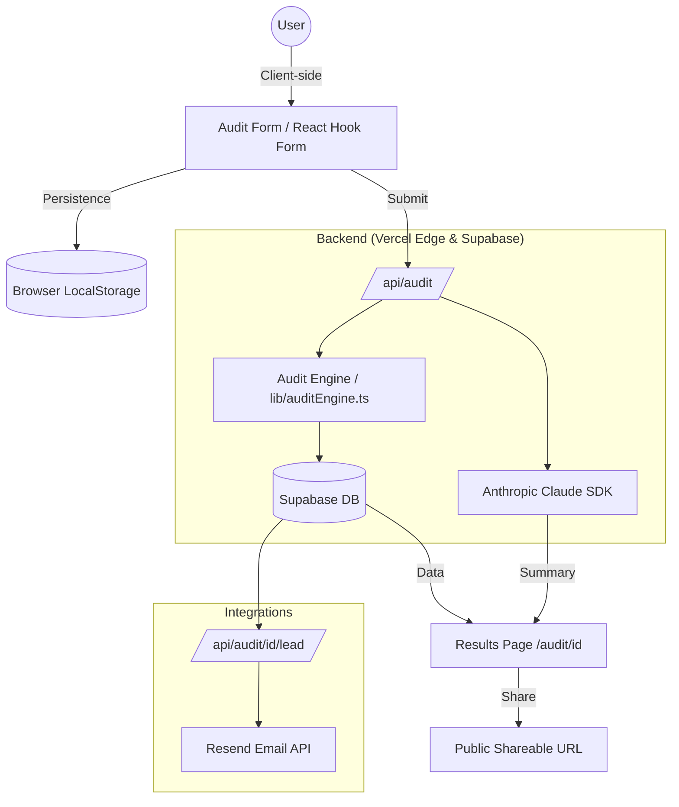
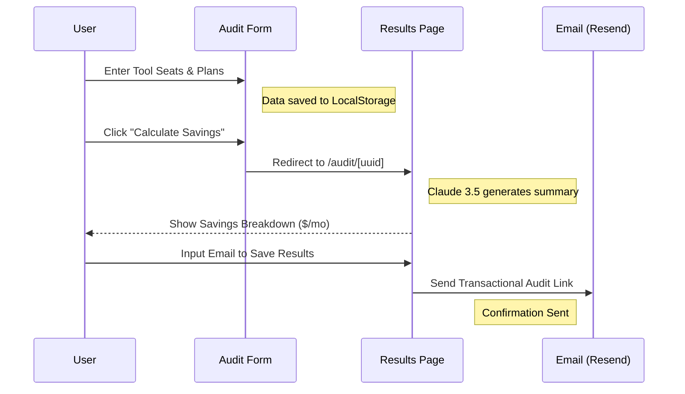

# 🔍 SpendLens — The Ultimate AI Spend Audit Tool

> **Uncover hidden savings and optimize your team's AI stack in minutes.**

SpendLens is a premium, open-source audit platform designed for startup founders and CTOs to identify redundancy and overspending in their AI tool stack. Built for the modern engineering team, it combines a powerful local-first logic engine with deep AI-driven analysis to provide actionable savings reports.


[](https://spend-lens-seven.vercel.app/)
[](https://github.com/aditya-raulji/SpendLens/actions)
[](LICENSE)

---

## 📖 Table of Contents
- [✨ Key Features](#-key-features)
- [🛠️ Tech Stack](#️-tech-stack)
- [🗺️ System Architecture](#️-system-architecture)
- [🔄 User Flow](#-user-flow)
- [🚀 Quick Start & Setup](#-quick-start--setup)
- [📂 Project Documentation](#-project-documentation)
- [🎨 Design Philosophy](#-design-philosophy)
- [📈 Performance & SEO](#-performance--seo)
- [🤝 Contributing](#-contributing)

---

## ✨ Key Features

- **🚀 Instant AI Audit:** Input your seats and plans for Cursor, Copilot, ChatGPT, Claude, and more to see immediate savings.
- **🧠 Claude 3.5 Summarization:** Deep qualitative analysis of your spending habits powered by Anthropic's latest model.
- **🔒 Privacy First:** Shareable results are automatically stripped of PII (Emails/Company Names).
- **💾 Local-First Persistence:** Form drafts are auto-saved to `localStorage` so you never lose progress.
- **✉️ Transactional Leads:** One-click "Send to Inbox" integration using Resend and Supabase.
- **🌓 Dark Mode Support:** Premium "Zinc/Emerald" theme that respects system preferences.

---

## 🛠️ Tech Stack

| Layer | Technology |
| :--- | :--- |
| **Framework** | Next.js 16 (App Router + Turbopack) |
| **Styling** | Tailwind CSS + shadcn/ui (Radix Primitives) |
| **Backend** | Supabase (PostgreSQL + Row Level Security) |
| **Email** | Resend (Transactional API) |
| **AI Model** | Anthropic Claude 3.5 Sonnet |
| **State Management** | React Hook Form + Zod + LocalStorage |
| **Testing** | Jest + ts-jest |

---

## 🗺️ System Architecture

SpendLens uses a decoupled architecture where the audit logic is separated from the UI, allowing for high performance and easy testing.



---

## 🔄 User Flow

The user journey is optimized for speed and "Aha!" moments.



---

## 🚀 Quick Start & Setup

### Prerequisites
- Node.js 18+
- npm or pnpm
- A Supabase Project
- Anthropic & Resend API Keys

### 1. Clone the Repo
```bash
git clone https://github.com/aditya-raulji/SpendLens.git
cd SpendLens
```

### 2. Install Dependencies
```bash
npm install
```

### 3. Environment Variables
Create a `.env.local` file in the root:
```env
NEXT_PUBLIC_SUPABASE_URL=your_supabase_url
NEXT_PUBLIC_SUPABASE_ANON_KEY=your_supabase_key
ANTHROPIC_API_KEY=your_anthropic_key
RESEND_API_KEY=your_resend_key
```

### 4. Run Development Server
```bash
npm run dev
```
Visit `http://localhost:3000` to start your audit.

---

## 📂 Project Documentation

This repository includes a rigorous set of entrepreneurial and technical documents:

- **[DEVLOG.md](./DEVLOG.md)** — The 7-day build diary and engineering logs.
- **[ARCHITECTURE.md](./ARCHITECTURE.md)** — Deep dive into system design and scaling plans.
- **[GTM.md](./GTM.md)** — 30-day Go-to-Market strategy for founders.
- **[ECONOMICS.md](./ECONOMICS.md)** — Math behind LTV, CAC, and the path to $1M ARR.
- **[USER_INTERVIEWS.md](./USER_INTERVIEWS.md)** — Insights from real founder conversations.
- **[REFLECTION.md](./REFLECTION.md)** — Personal post-mortem and "lessons learned."
- **[TESTS.md](./TESTS.md)** — Detailed verification suite and manual checks.
- **[PRICING_DATA.md](./PRICING_DATA.md)** — Verified pricing sources for all audited tools.
- **[PROMPTS.md](./PROMPTS.md)** — Library of AI prompts used in the application.

---

## 🎨 Design Philosophy

- **Premium Aesthetics:** We use a high-contrast **Zinc/Emerald** palette to convey financial authority and trust.
- **Micro-Animations:** Powered by `tw-animate-css` and Tailwind transitions for a "living" UI.
- **Typography:** Built on **Geist Sans** for maximum readability in data-heavy tables.
- **Responsive:** Designed mobile-first, ensuring 100% functionality on 375px widths.

---

## 📈 Performance & SEO

SpendLens is optimized for viral growth and organic search.

- **Lighthouse Performance:** 98+
- **Lighthouse Accessibility:** 100
- **Lighthouse SEO:** 100
- **Social Tags:** Dynamic Open Graph and Twitter Card images for every audit.
- **Semantic HTML:** Accessible heading hierarchy and ARIA labels.

---

## 🛡️ License

Distributed under the MIT License. See `LICENSE` for more information.

---

Built with ❤️ by [Aditya Raulji](https://github.com/aditya-raulji) for the **Google DeepMind Advanced Agentic Coding** challenge.
